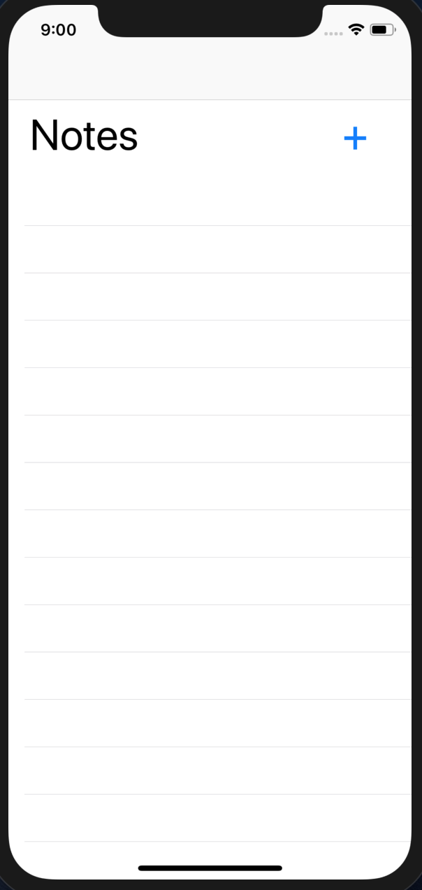
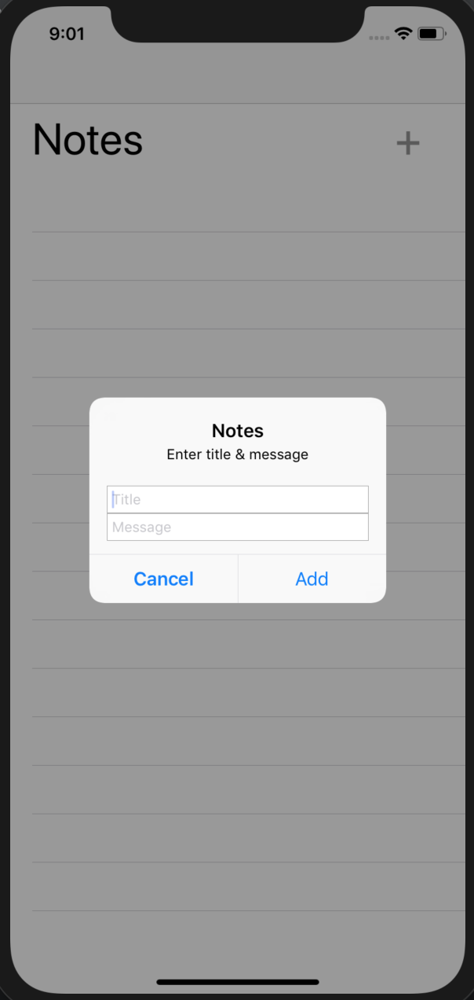
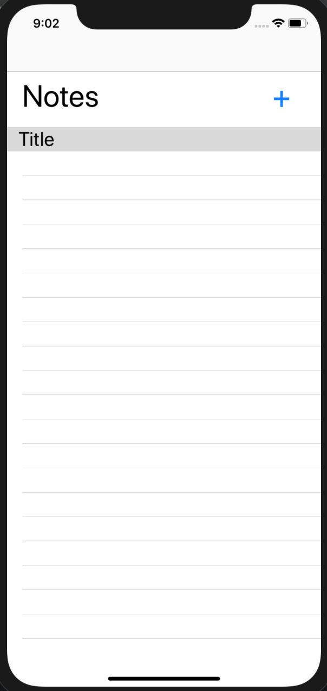
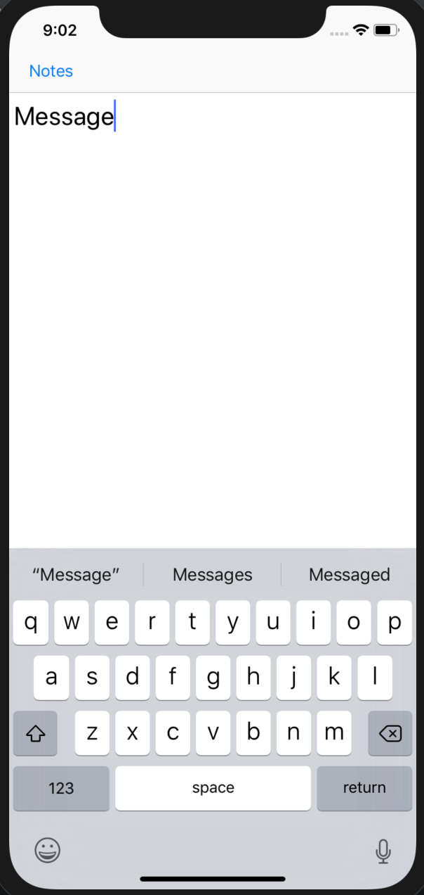
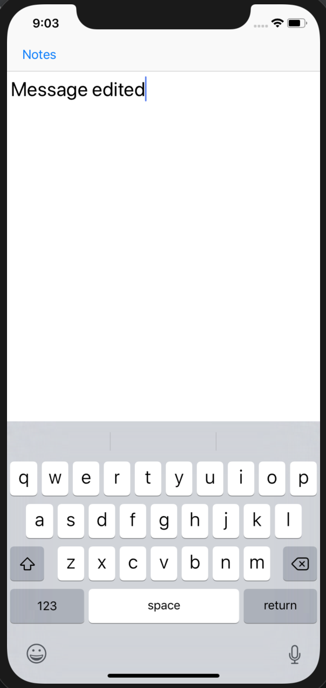
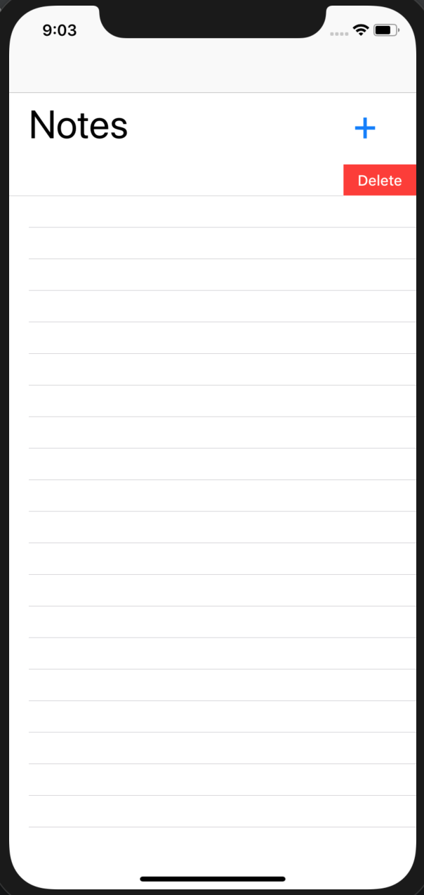

# Notes

### Basic Idea:

This app will help you to create, modify and delete note. 

### Steps for Application:

1) Create note using '+' button on top.
2) Add title and message.
3) Tap title to see message.
4) Message can be edited.
5) By swiping left to the title, note can be deleted.

### Requirements:

1) Mac OS 10 or higher
2) Swift programming
3) IOS latest version
4) UIKit and Xcode

### Screenshot:

